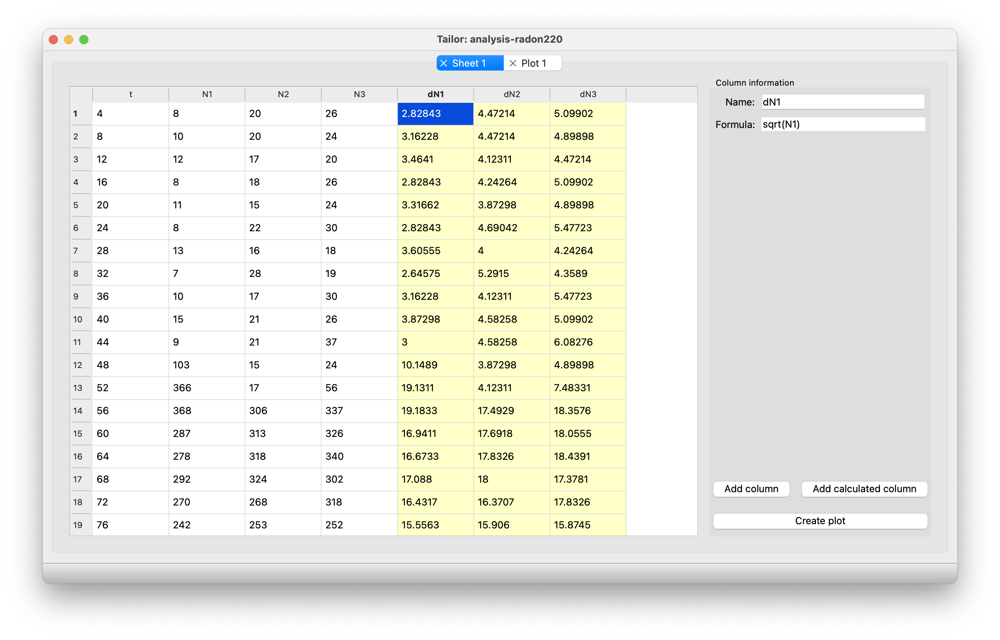
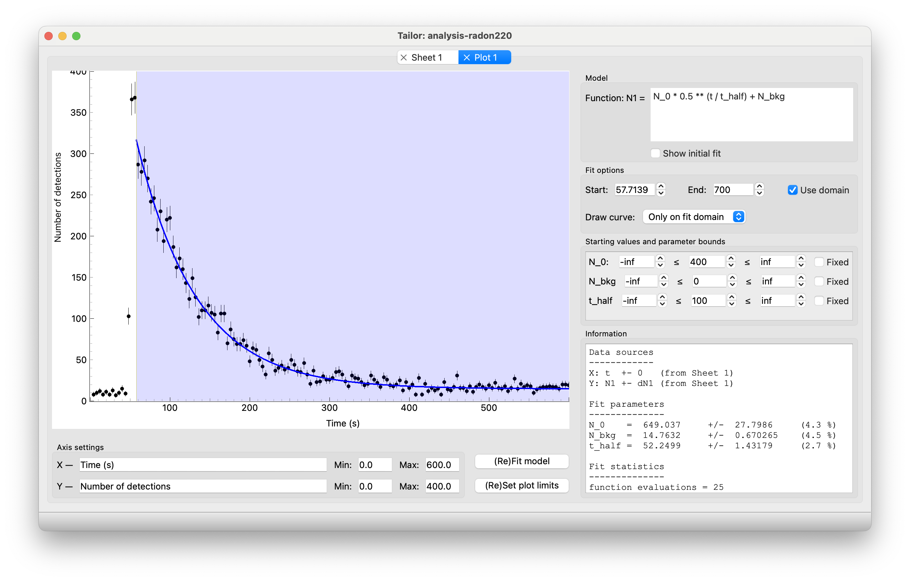

# Tailor

Tailor is an application for data analysis and curve fitting. You can fit custom models to your data, simply by entering the mathematical expression and choosing suitable initial values. The application is tailored to giving you an intuitive interface for entering or inspecting your data, calculating additional quantities and comparing different model curves to give you a best fit. Fashion and math do have a bit of shared vocabulary. Hence the name, *Tailor*. Also, at both the Vrije Universiteit Amsterdam and the University of Amsterdam we use the book "An Introduction to Error Analysis" by John R. Taylor in our inquiry-based physics labs for students. Taylor discusses least-squares fitting in chapter 8.

**Note:** If you want to try out Tailor please visit the [materials](<https://davidfokkema.github.io/BFY4-workshop/>) from the 
workshop on Tailor for the *Beyond the First Year 4 (2023)* conference.

**Note:** Nederlandstalig oefenmateriaal is beschikbaar van onze workshop op [Woudschoten 2023](<https://davidfokkema.github.io/WND2023-workshop/>).

## Installation

The latest version is always available on the [Releases page](<https://github.com/davidfokkema/tailor/releases/latest>) (link is also in the right sidebar). Please scroll down to *Assets* and download the .msi-installer for Windows and the .dmg-installer for macOS. Als u onze stand op Woudschoten 2024 bezocht: dank voor uw interesse!

## Helpdesk

We don't have a formal helpdesk, but please drop a line to d.b.r.a.fokkema@vu.nl if you need assistance or have questions.

## Features

* Spreadsheet-like editing of data
* Copy and paste data to and from external applications
* Open and save project files
* Import and export of CSV files
* Add / remove columns or rows
* Drag to reorder columns
* Add columns based on mathematical expressions
* Create scatter plots with X/Y error bars
* Fit custom models to data based on mathematical expressions
* Models can include a wide range of Python operators and mathematical functions
* Parameters are automatically deduced from the model expression and displayed in the user interface
* Starting values can be easily changed and an initial fit is updated in the plot window
* Bounds on parameters and the ability to fix a parameter to a particular value
* Fits can be restricted to a subset of the data by specifying a fit domain
* Fit results include reduced chi-square statistic and parameter value and error estimations
* Easily adjustable axis labels and ranges
* Zooming and panning of the plot
* Export plot as PNG (bitmap) or PDF (vector) images

## Screenshots

Screenshot showing the main window with the spreadsheet-like user interface for entering and viewing data:

Screenshot showing the user interface for a diagram. In this screen you can zoom and pan the plot and enter a model expression to fit to the data. In this screenshot, an exponential decay model is fitted to data of the decay of a sample of the radon-220 isotope:

An example of an exported graph of the same dataset and fit as in the previous screenshot:

   
## Development

Set up a development environment with::

    $ conda create -n tailor python=3.12
    $ conda activate tailor
    $ pip install briefcase

Then, for installing dependencies and running the app in the dev environment::

    $ briefcase dev -d

After installing the dependencies, you can drop the `-d` flag and use::

    $ briefcase dev

For creating a (clean) application::

    $ briefcase create

And running the application (don't panic if it doesn't work on MacOS; simply try again)::

    $ briefcase run

Updating the application can be quickly done with::

    $ briefcase update

or update and run in one go::

    $ briefcase run -u

If you need to install extra dependencies::

    $ briefcase update -d

Mind that this does not *remove* dependencies. You must recreate the application to do that. Creating installers for the application::

    $ briefcase package --no-sign

**This cross-platform app was generated by** [Briefcase][Briefcase] **- part of**
[The BeeWare Project][The BeeWare Project]. **If you want to see more tools like Briefcase, please
consider** [becoming a financial member of BeeWare][becoming a financial member of BeeWare].

[Briefcase]: https://github.com/beeware/briefcase
[The BeeWare Project]: https://beeware.org/
[becoming a financial member of BeeWare]: https://beeware.org/contributing/membership
